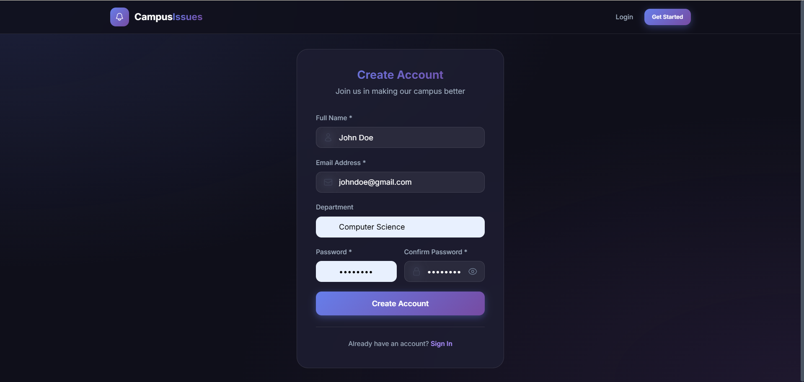
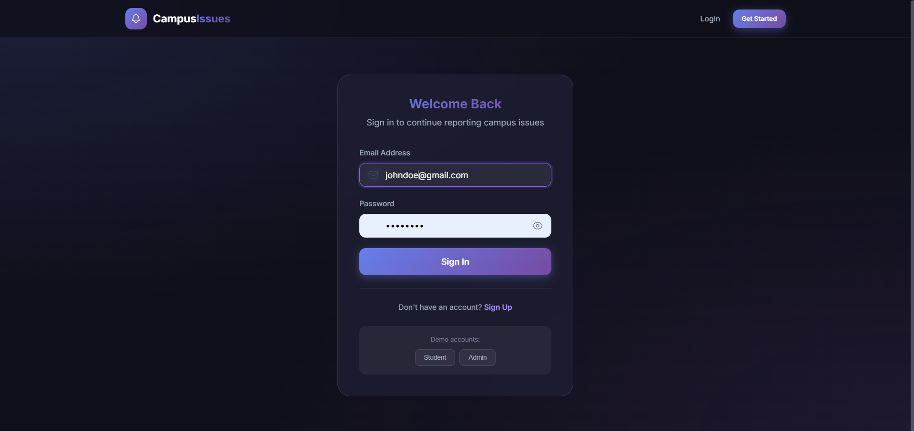
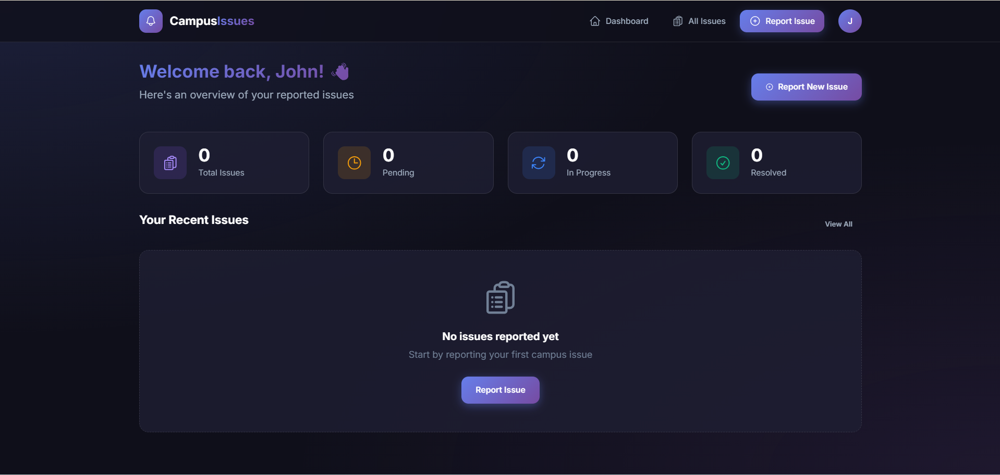
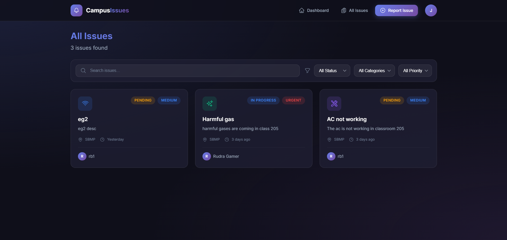
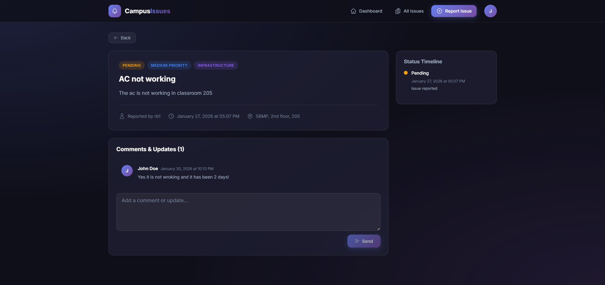
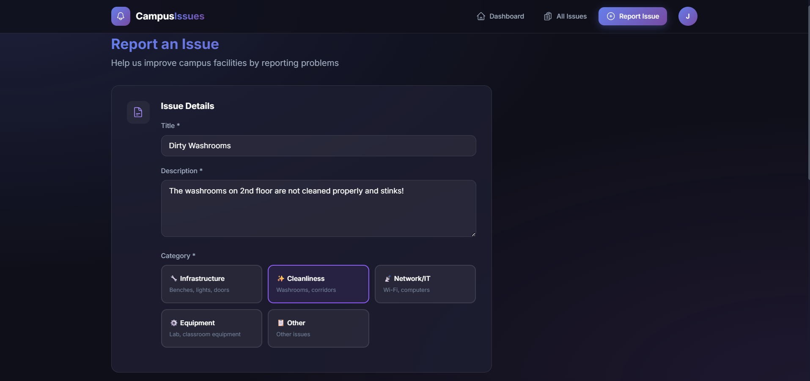
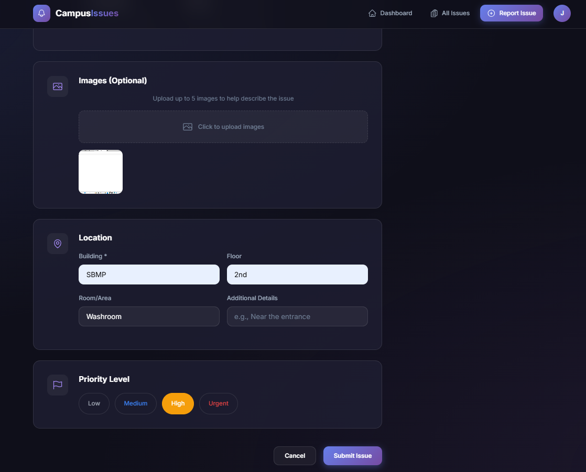
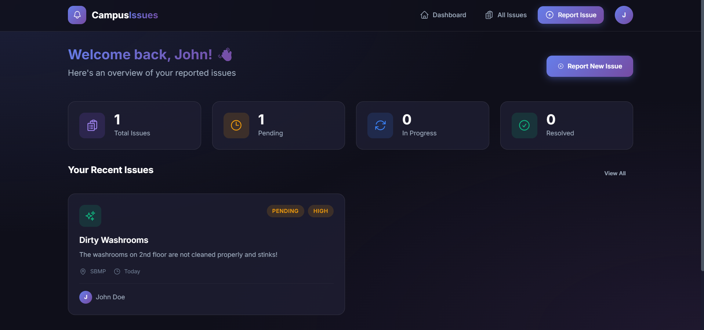
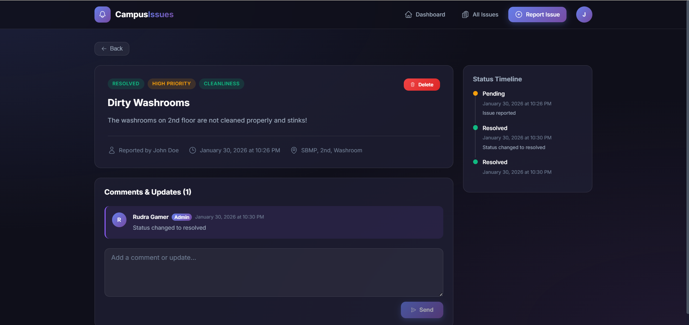

# Smart-Campus-Issue-Tracker-
A smart campus issue tracking system where students and faculty can report infrastructure and facility problems such as AC not working, damaged computers, dirty bathrooms, broken windows, and poor water quality.

All reported issues are managed by admins, who can track, update, and resolve them using a proper issue status workflow.

📸 Screenshots
Sign Up

Sign In

Dashboard

All Issues Page

Issue Details

Report New Issue – Step 1

Report New Issue – Step 2

Issue Submitted

Issue Resolved
